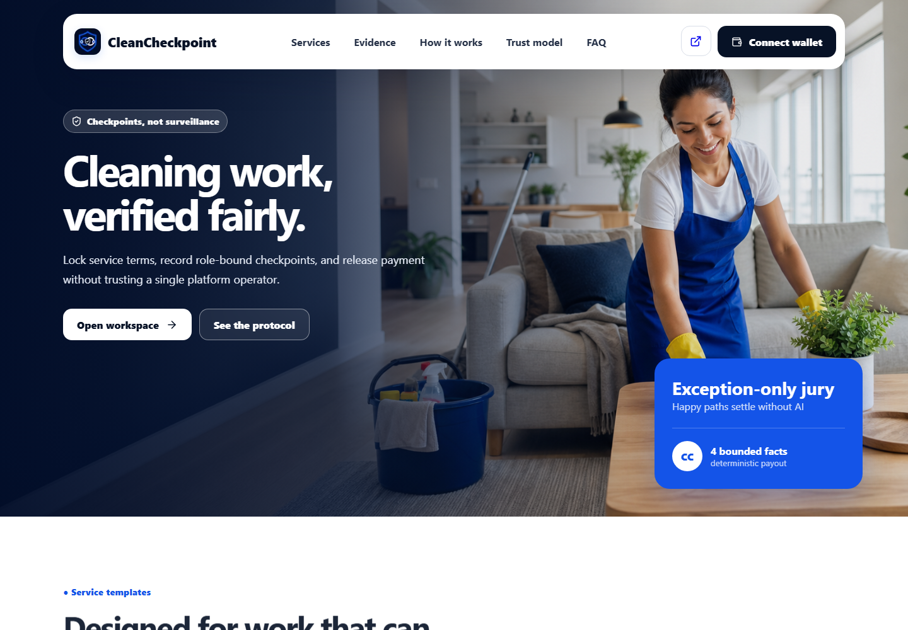
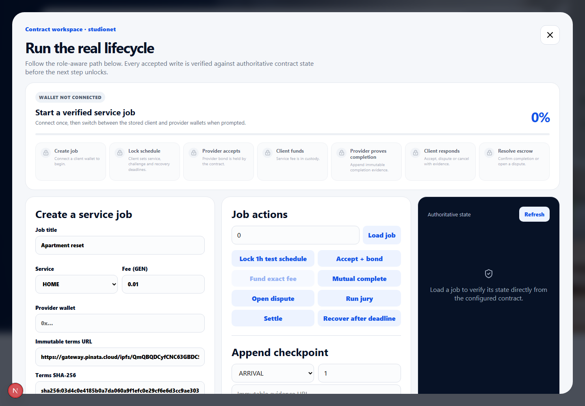

# Guided lifecycle workspace v1

## Before

The accepted project exposed a technically complete workspace, but eight contract actions appeared as an undifferentiated button grid. Users had to infer the required wallet role, order, and current stage.



## After

The workspace now presents seven derived lifecycle stages, four wallet roles, and three visual states (`complete`, `available`, `locked`). Progress is computed from authoritative `get_job` fields, not optimistic browser state. Four unit tests cover address normalization and state progression.



## Verification

```bash
npm run test:ui
python -m pytest tests -p no:cacheprovider
npm run lint
npm run build
```

This UX milestone does not change the contract source or custody semantics, so the existing studionet deployment remains authoritative.
